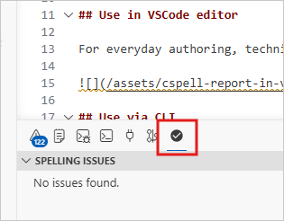

We use Code Spell Checker (CSpell) to check for spelling issues in Kore.ai product documentation.

We've added 1200+ words to our custom dictionaries to avoid false positives. You must use it with our config rather than running it on default settings.

## Configure CSpell to work in VSCode Editor

1. Clone [koreaidocs-cspell-config](https://github.com/ashishguptaiitb/koreaidocs-cspell-config) repo.

1. Install [streetsidesoftware.code-spell-checker](https://marketplace.visualstudio.com/items?itemName=streetsidesoftware.code-spell-checker) VSCode extension.

1. Configure CSpell as described in [this internal video](https://drive.google.com/file/d/1kohoQskuHhwFykV5ZyUz-cPdLFeCcRD_/view). It'll let CPsell extension use the custom dictionaries.

## Use CSpell in VSCode editor for everyday authoring

For everyday authoring, technical writers use the spell checker in VSCode when authoring content. Click **View** > **Problems** and then click on **Spell Checker**.

## Use CSpell with the same dictionary anywhere else

:::important
Fetch the latest updates of the cloned CSpell repo. It gets you the latest custom dictionaries and spell-check rules.
:::

Use case: You want to use cspell outside the repo. For example, I use it on standalone .md files in my `Downloads` folder.

Just copy the `.cspell.json` file that you create [here](#configure-cspell-to-work-in-vscode-editor) into a different repo or folder on your local filesystem.

## Resolve CSpell-reported issues

In our cspell output, note the following:

- Some typos need an update in the docs. For example, misspelt words or use of British English.

- Ignore some issues. Two examples are:

  - When we mask a URL using `xxx`, then let it be. No update required.
  - Some valid words in Kore docs that must remain as is. I add such words to our custom dictionary, so that CSpell doesn't flag these words the next time.

- The report also contains some `forbidden` words that we don't want to use in docs. For example, future tense will, time-sensitive writing currently, colloquial usage, and more. Treat these as typos and rewrite the sentence to not use these words.

:::info
To get new words added to our custom dictionary, share the .mdx file's URL with me.
:::

## Use via command line for bulk checks

Editors, repo owners, or manager can use the same via CLI to check repo health. Native config via [json file](.cspell.json). The following are a few CLI examples for common use cases.

| Use case | Command | Remarks |
|:---------|:----------|:-----------|
| Check one file | `npx cspell --config <path to .cspell.json> <path of MD files>` | |
| Recursively check files in the current folder  |  `npx cspell --config <path to .cspell.json>` |   |
| Recursively check MD files in the current folder | `npx cspell --config <path to .cspell.json> "**/*.md"` |   |
| Recursively check MD files in the current folder and save the output in a local file | `npx cspell --config <path to .cspell.json> "**/*.md" > <path of a local file>` |  |

## Use 

<!-- AG: Check how to embed GDrive video in Docusaurus page. Potential approach can be 
* to get iframe embed code from GDrive.
* use .mdx file.
* use iframe with HTML5 syntax.
* Check dependencies in Docusaurus or config to build .mdx and display video with access controls.

-->