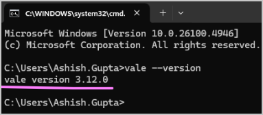

## Install Vale for CLI use

1. On the command prompt, execute the command `winget install --id=errata-ai.Vale -e`.

1. To make sure that Vale is successfully installed, execute the command `vale --version`. It must display a version number.  
   

## Use Vale in CLI to check a folder

< Instructions are TBD >
